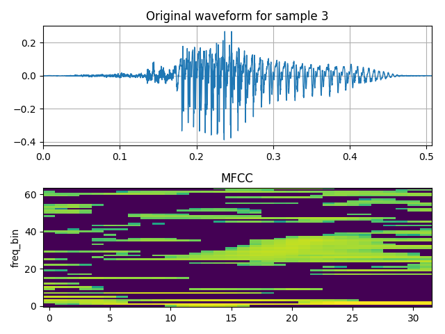
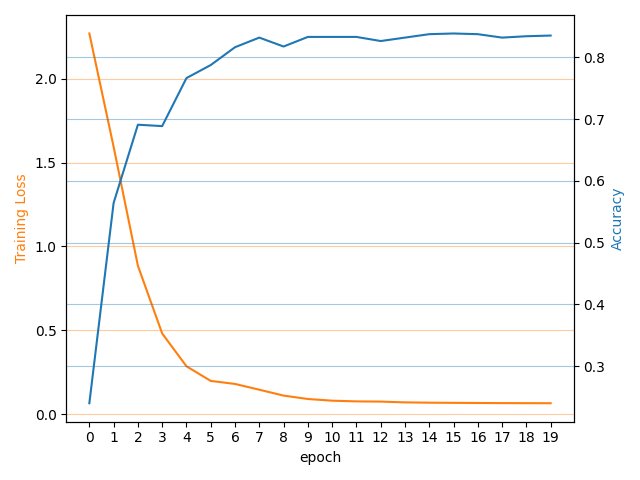

# speech-recognition-snn

## Dataset

[https://github.com/Jakobovski/free-spoken-digit-dataset](https://github.com/Jakobovski/free-spoken-digit-dataset)

Put audio files in `.data/recordings`

## Environment

Create environment using `python3 -m venv .venv`

Activate environment with `source .venv/bin/activate`

Install dependencies with `pip install -r requirements.txt`

## Run
```bash
python3 snn.py
```

## Sample output





Code for plot is commented out. Uncomment only after making sure you aren't plotting 3000 times.

## Formatting used
```bash
black -l 120 *.py
```